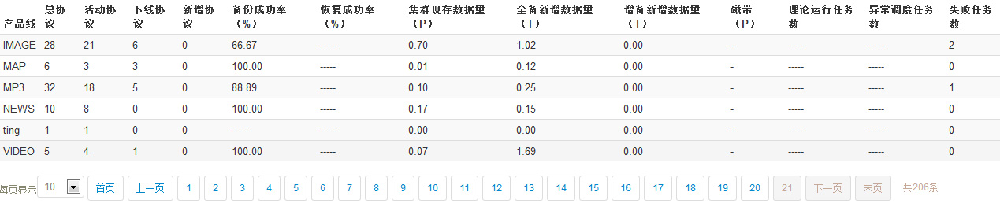

jPagerAjax
==========

create page from ajax data

# jPagerAjax效果图 #

# 参数 #

* @config {string} 			position 分页显示的位置； after: 在内容的后面，before: 在内容的前面

* @config {Boolean} 			showLength 首否显示总共多少条；true: 显示共多少条信息, false: 不显示

* @config {Boolean} 			showSelect 是否显示选择下拉框；true: 显示下拉框选择条数, false: 不显示

* @config {Boolean} 			showAction 是否显示首页，末页，上一页，下一页；true: 显示, false: 不显示

* @config {int}                perPage 每页显示多少条信息

* @config {int}                totalCount 总共多少条信息

* @config {array}              select 下拉框的信息，这个是showSelect为true时设置才有效 [10, 20, 50, 100]

* @config {int}                curPage 默认显示哪一页

* @config {int}                pageCount 总共多少页

* @config {object}             textmap: {
								first: "首页",
								last: "末页",
								prev: "上一页",
								next: "下一页"
							}
							
* @config {function}           onPageClick 页码点击事件

* @config {function}           onSelect 下拉框点击事件

* @config {string}             children 孩子元素

# 使用方法 #

引用css, js

&lt;link rel="stylesheet" type="text/css" href="jPagerAjax/jPagerAjax.css"&gt;

&lt;script type="text/javascript" src="jPagerAjax/jquery-1.8.0.js"&gt;&lt;/script&gt;

&lt;script type="text/javascript" src="jPagerAjax/jquery.jPagerAjax.js"&gt;&lt;/script&gt;

<code javascript>
$("#table").jPagerAjax({

	position: "after",  
	
	showLength: true,  
	
	showSelect: true, 
	
	showAction: true,  
	
	perPage: data.per_page,  
	
	totalCount: data.total,  
	
	select: [10, 20, 50, 100],
	
	curPage: data.cur_page,  
	
	pageCount: Math.ceil(data.total/data.per_page), 
	
	textmap: {
		first: "首页",
		last: "末页",
		prev: "上一页",
		next: "下一页"
	}, 
	
	onPageClick:  function(curPage){  
		if(curPage!=""){
			renderTable(curPage, per_page);							
		}
	},
	
	onSelect: function(perPage){
		renderTable(1, perPage);
	},  
	
	children: "tr"                
});
</code>

